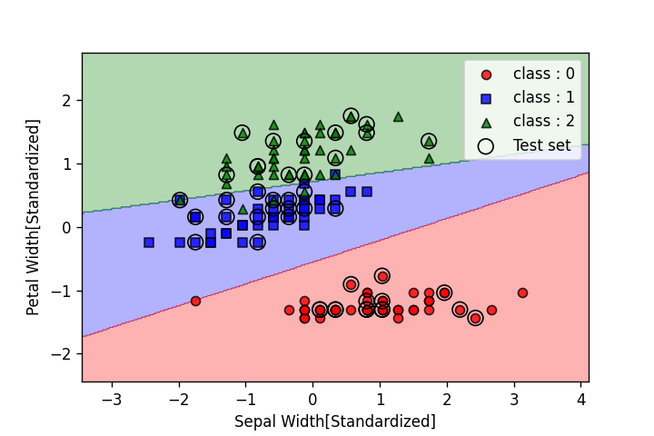
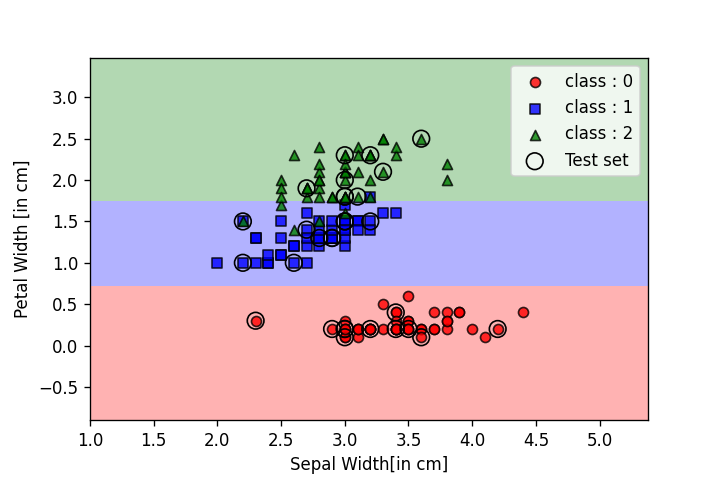
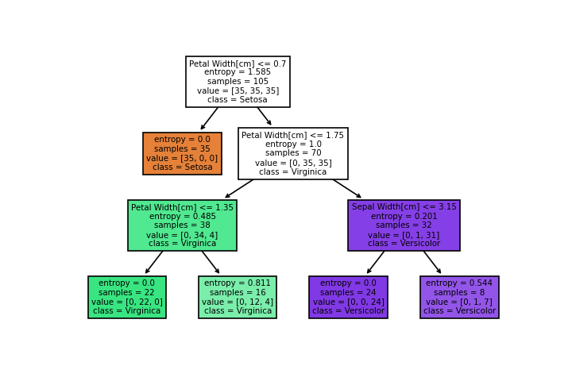

# Classification_with_Different_ML_models
## PROBLEM STATEMENT:
To classify the three different classes of iris flowers from the given IRIS dataset

## DATA_SET USED:
>[IRIS_DATASET](https://archive.ics.uci.edu/ml/machine-learning-databases/iris/)

## LIBRARIES USED:
- pandas
- numpy
- matplot
- scikit-learn

## MODELS USED:
- Support Vector Machine(Linear)
- Decision Tree Classifier

## Support Vector Machine Output:

## Decision Tree Classifier Output:

## Decision Tree Classifier Visualization:

